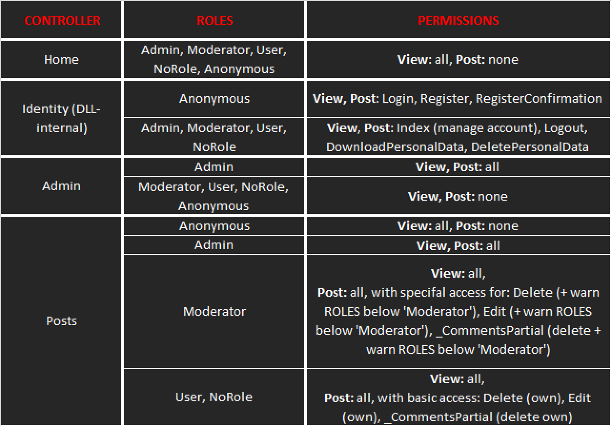

# SelenicSparkApp
Ready to deploy forum/blog web app written on C# using ASP.NET Core MVC, EFC, MS SQL Server.

## Features:
- User authentication (including 2FA)
- User registration
- Role-based authorization
- Automatic user's account lock on 5 bad login attemps (defaults to 15 minutes)
- Built-in admin panel that allows to manage users and roles
- Built-in basic moderation tools: warn user, delete post/comment, ban user
- Built-in user account page (edit username, password)
- Simple blog-like posts multi-page UI: create (markdown supported!), view, edit, delete
- Search for posts (by title, text, author - or all at once)

## Suspended default features:
- Email services: users cannot change email themselves, app doesn't require actual email to confirm registration
- Reset password function (because of email services)

## Planned features:
- Moving project to MySQL + WebAPI + Vue
- Page indexing for search posts form
- Custom color codes for each role, stored in database
- Toggle dark mode for all pages at any time
- User profile page (users)
- Search for users
- Live website sample  
- Microservice architecture (?)

## Permissions table (per controller):
  

## Known issues:
- Some UI parts might be misaligned on mobile devices with small screens

## License:
**[Apache 2.0 License](LICENSE)**
```
This software may include third party components with separate legal 
notices or governed by other agreements, as may be described in the 
ThirdPartyLicense file(s) accompanying the software.
```
